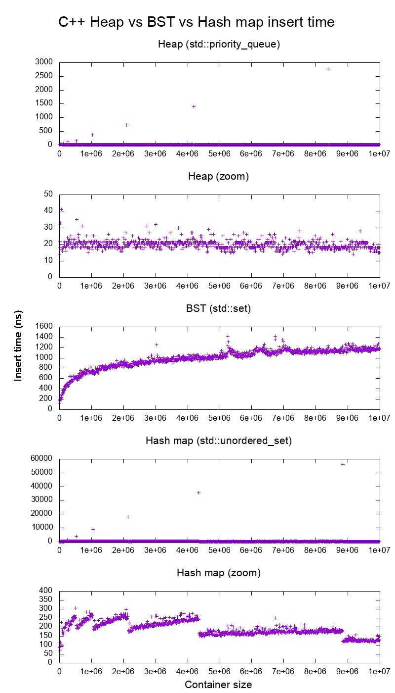

### std::map VS. std::unordered_map

Different libraries may employ diverse strategies in their implementations. In this discussion, we will narrow our focus to the source of stdlibc++.

The std::map, as part of its underlying implementation, utilizes a Red-black tree. This is a specific type of binary tree characterized by an additional bit signifying 'red' or 'black.' The purpose of this extra bit is to rearrange the tree to achieve better balance. Employing a binary tree is a logical choice considering a std::map can be traversed in order - an operation that would be less efficient if performed with a hash map.

On the other hand, std::unordered_map employs a hash table (which includes a linked list for each bucket) in its underlying implementation. The rationale for using a hash table is that a std::unordered_map does not offer the capability to traverse in order. Therefore, the standard library opts for a hash map instead of a Red-black tree, as the former provides superior amortized time complexity for insert operations.

The decision to use either map or unordered_map is largely determined by whether the data being inserted needs to be sorted.

```
                      map            unordered_map
Insert               log(n)              1
Find any             log(n)              1    
Find max/min           1                 n (checking if a bucket is empty for all slots in the hash table also may give you a big constant)
Delete               log(n)              1
```
### std::set VS. std::unordered_set

The std::set, as part of its underlying implementation, utilizes a Red-black tree. Employing a binary tree such as Red-black tree is a logical choice considering a std::set can be traversed in order - an operation that would be less efficient if performed with a hash map.

On the other hand, std::unordered_set employs a hash table (which includes a linked list for each bucket) in its underlying implementation. The rationale for using a hash table is that a std::unordered_set does not offer the capability to traverse in order. Therefore, the standard library opts for a hash map instead of a Red-black tree, as the former provides superior amortized time complexity for insert operations.

The decision to use either set or unordered_set is largely determined by whether the data being inserted needs to be sorted.

```
                      set            unordered_set
Insert               log(n)              1
Find any             log(n)              1    
Find max/min           1                 n (checking if a bucket is empty for all slots in the hash table also may give you a big constant)
Delete               log(n)              1
```
### set (unordered_set) VS. map (unordered_map)

Set(unordered_set) and map (unordered_map) are extremely similar. They are designed and separated for different using niche. The map stores pairs of (key, value), wile set stores only keys.


### Heap VS. Binary Search Tree (BST)

Heap is a kind of binary tree. However, Heap just guarantees that elements on higher levels are greater (for max-heap) or smaller (for min-heap) than elements on lower levels, whereas BST guarantees order (from "left" to "right"). If you want sorted elements, go with BST

Heap is better at findMin/findMax (O(1)), while BST is good at all finds (O(logN)). Insert is O(logN) for both structures. If you only care about findMin/findMax (e.g. priority-related), go with heap. If you want everything sorted, go with BST.

```
          Type      BST (*)   Heap
Insert    average   log(n)    1
Insert    worst     log(n)    log(n) or n (***)
Find any  worst     log(n)    n
Find max  worst     1 (**)    1
Create    worst     n log(n)  n
Delete    worst     log(n)    log(n)
```
All average times on this table are the same as their worst times except for Insert.

- *: everywhere in this answer, BST == Balanced BST, since unbalanced sucks asymptotically
- **: using a trivial modification explained in this answer
- ***: log(n) for pointer tree heap, n for dynamic array heap

#### Advantages of binary heap over a BST

- average time insertion into a binary heap is `O(1)`, for BST is `O(log(n))`. This is the killer feature of heaps.

There are also other heaps which reach O(1) amortized (stronger) like the [Fibonacci Heap](https://en.wikipedia.org/wiki/Fibonacci_heap), and even worst case, like the [Brodal queue](https://en.wikipedia.org/wiki/Brodal_queue), although they may not be practical because of non-asymptotic performance: [link](https://stackoverflow.com/questions/30782636/are-fibonacci-heaps-or-brodal-queues-used-in-practice-anywhere)

- binary heaps can be efficiently implemented on top of either dynamic arrays or pointer-based trees, BST only pointer-based trees. So for the heap we can choose the more space efficient array implementation, if we can afford occasional resize latencies.

#### Advantages of BST over a binary heap
- search for arbitrary elements is `O(log(n))`. This is the killer feature of BSTs.

For heap, it is `O(n)` in general, except for the largest element which is `O(1)`.

#### Average binary heap insert is `O(1)`
Sources:

- Paper: [link](http://i.stanford.edu/pub/cstr/reports/cs/tr/74/460/CS-TR-74-460.pdf)
- [WSU slides](https://web.archive.org/web/20161109132222/http://www.eecs.wsu.edu/~holder/courses/CptS223/spr09/slides/heaps.pdf)

Intuitive argument:

- bottom tree levels have exponentially more elements than top levels, so new elements are almost certain to go at the bottom
- heap insertion starts from the bottom, BST must start from the top

In a binary heap, increasing the value at a given index is also `O(1)` for the same reason. But if you want to do that, it is likely that you will want to keep an extra index up-to-date on heap operations: [link](https://stackoverflow.com/questions/17009056/how-to-implement-ologn-decrease-key-operation-for-min-heap-based-priority-queu) e.g. for Dijkstra. Possible at no extra time cost.

### Insertion Performance Showcase



